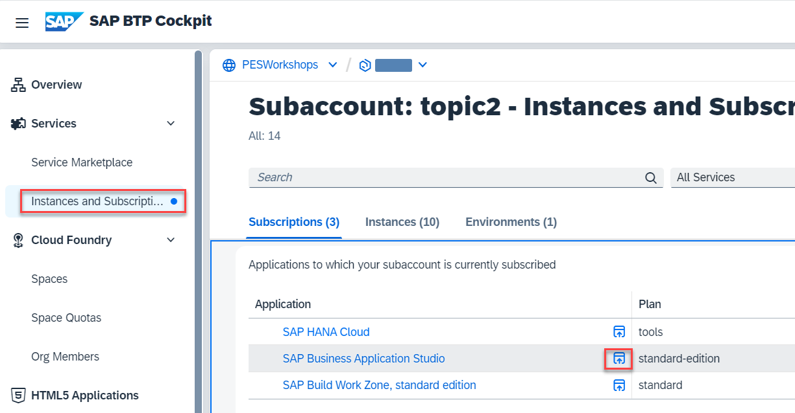
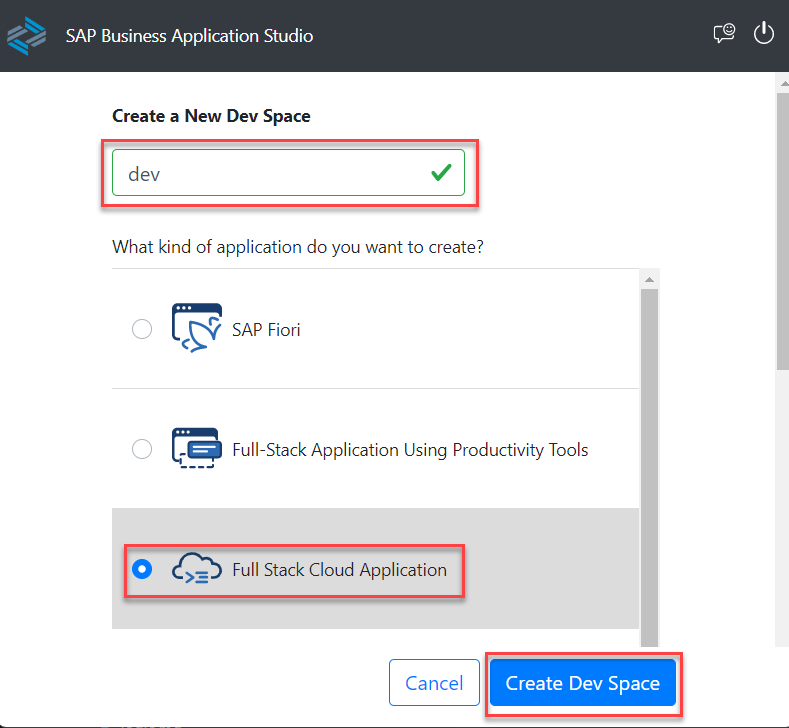
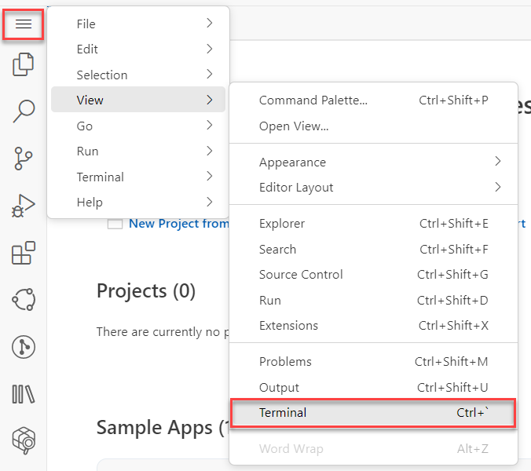
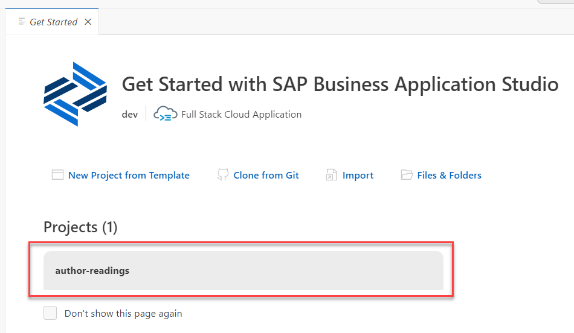
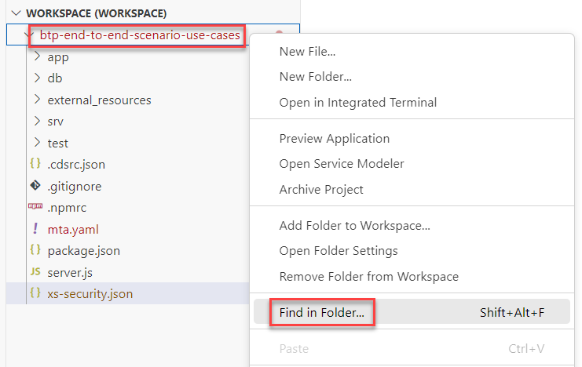
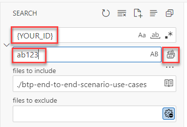
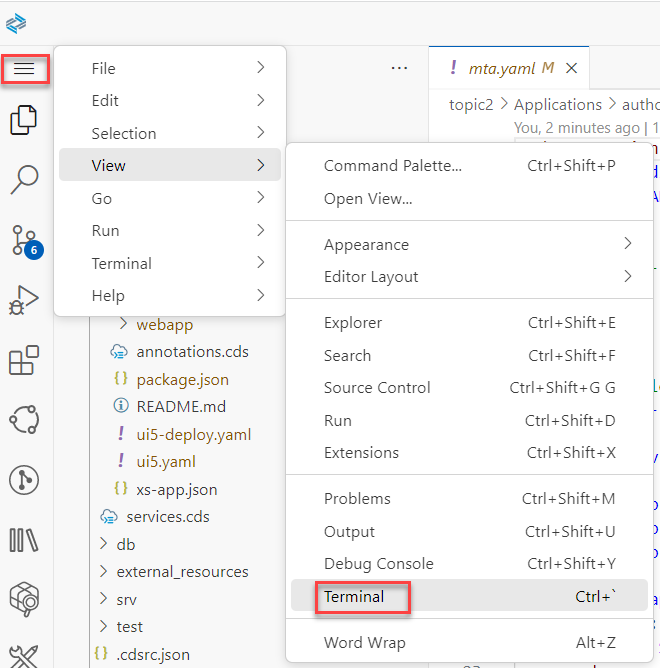

# Codebase Preparation

## Introduction 

In this section, you will prepare a workspace in SAP Business Application Studio and clone the workshop repository there. Then you will prepare the code to be deployed.

## Task Flow  

In this exercise, you will perform the following tasks:

1. Create development space
2. Clone repository
3. Prepare the codebase

## Content

### Task 1: Create development space

1. In **SAP BTP Cockpit**, navigate to your subaccount.

2. From your left-side subaccount menu, navigate to **Services** &rarr; **Instances and Subscriptions**.

3. Select **Go To Application** button for **SAP Business Application Studio**.

   

4. Select **Create Dev Space** button.

   

5. Enter **dev** as the space name and select **Full Stack Cloud Application**. Then choose **Create Dev Space** button.

  

> It may take several minutes. Please be patient.

6. After the space status has been changed to **RUNNING** select the space name to navigate into.
 
   

### Task 2: Clone repository

1. On the initial screen choose the "burger" button and then select *View* &rarr; *Terminal* option in the popup menu.

   

2. Switch to the projects folder with the following command:

~~~cli
cd projects
~~~

3. Clone the repository with the following command:

  ```url
  git clone https://github.com/SAP-samples/btp-end-to-end-scenario-use-cases.git -b topic2app
  ```

   

4. After the cloning has been finished you will see a new project **author-readings** in the **Get Started** window. Just select it to open.

   

### Task 3: Prepare the codebase

> As all the workshop participants work in one subaccount and one SAP S/4 HANA Cloud system the name of the created artifacts must be unique. To distinguish the objects for all participants in the workshop use the following naming convention: Replace **{YOUR_ID}** in every exercise with your initials plus a 3 digit number. For example instead of **MY_OBJECT_{YOUR_ID}**, use **MY_OBJECT_AB123**. 

1. On the left side in the file explorer select **btp-end-to-end-scenario-use-cases** folder and call the popup menu. Select **Find in Folder...** option.

   

2. Enter **{YOUR_ID}** as the text to find and your ID (e.g. ab123) as the text to replace. Select **Replace all** button afterwards.

   

3. Select the "burger" button to call the main menu and select *View* &rarr; *Terminal* option.

   

4. In the terminal install the packages with the command:

  ```cli
  npm i
  ```

  

## Result

You have now the codebase with your application ready to be deployed.

[Next Tutorial: Deploy the application](./deploy.md)

