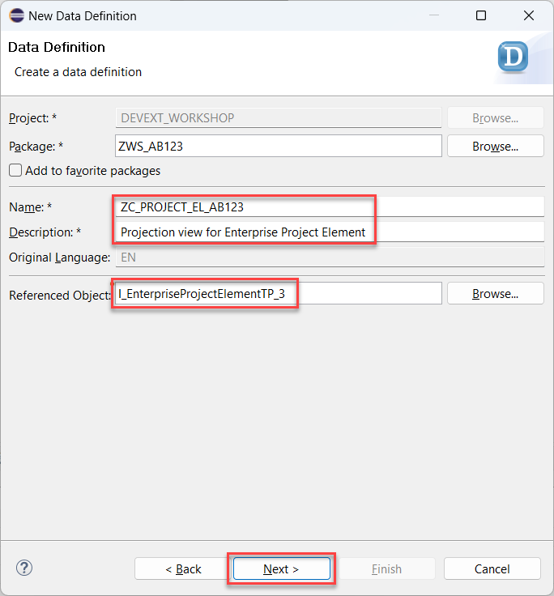
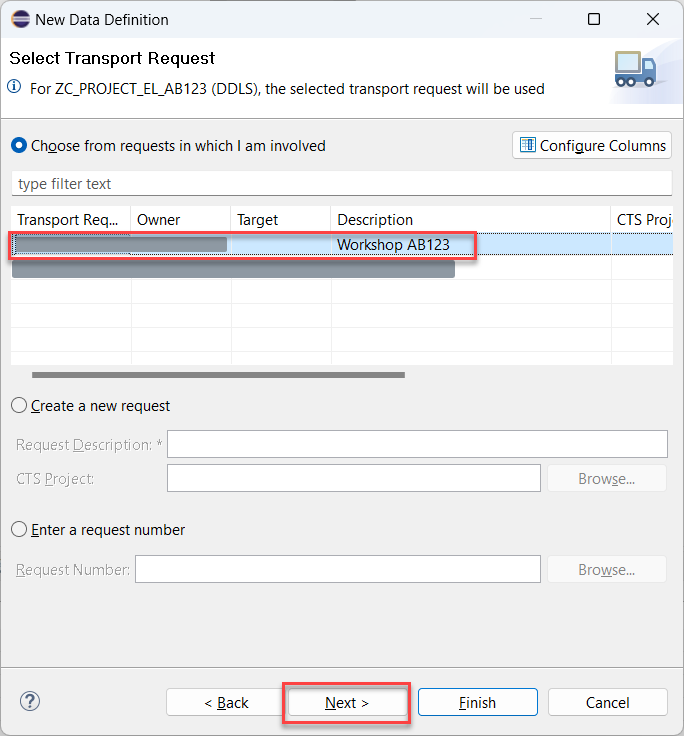
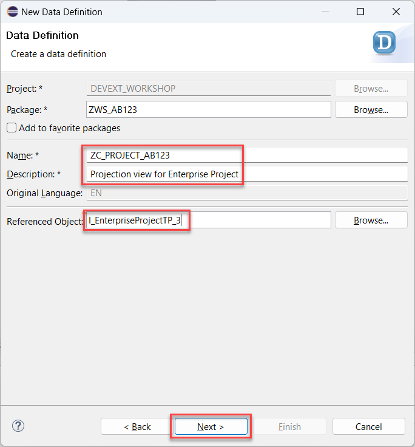
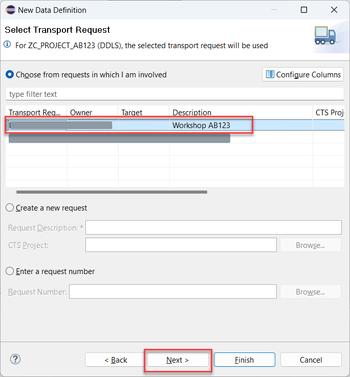
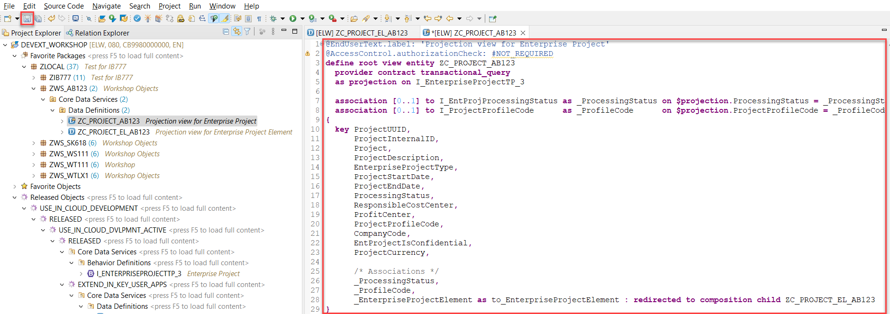
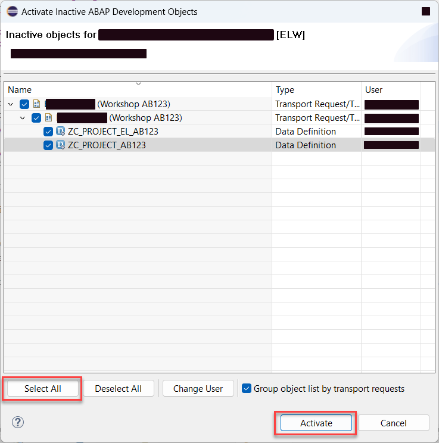

# Create Data Definition

## Introduction 

In this exercise, you will create CDS view projections which will represent the data model of your service. These projections will be based on the Business Object interface *I_EnterpriseProjectTP_3* and its child composition *I_EnterpriseProjectElementTP_3* which are released by SAP for Cloud development.

## Task Flow  

In this exercise, you will perform the following tasks:

1. Create projection for Enterprise Project Element
2. Create projection for Enterprise Project

## Content

### Task 1: Create projection for Enterprise Project Element

1. Right click on your package name created in the previous exercise.

2. Choose **New** &rarr; **Other ABAP Repository Object** option in the context menu.

   

3. Choose **Data Definition** in the **Core Data Services** folder and then choose **Next**.

   

4. Enter the following data and then choose **Next**:
  - **ZC_PROJECT_EL_{YOUR_ID}** in the **Name** field
  - **Projection view for Project Element** in the **Description** field
  - **I_EnterpriseProjectElementTP_3** in the **Referenced Object** field

  

5. On the next screen select your transport and choose **Next**.

   

6. On the next screen select the **Define Projection View** template and then choose **Finish**.

  

7. Replace the code of the view with the one below (considering **{YOUR_ID}** replacement) and then choose **Save** button.

~~~abap
@EndUserText.label: 'Projection view for Project Element'
@AccessControl.authorizationCheck: #NOT_REQUIRED
define view entity ZC_PROJECT_EL_{YOUR_ID} as projection on I_EnterpriseProjectElementTP_3
{
    key ProjectElementUUID,
    ProjectElement,
    ProjectElementDescription,
    ProjectUUID,
    PlannedStartDate,
    PlannedEndDate,
    
    _EnterpriseProject: redirected to parent ZC_PROJECT_{YOUR_ID}
}
~~~

  

### Task 2: Create projection for Enterprise Project

1. Right click on your package name created in the previous exercise.

2. Choose **New** &rarr; **Other ABAP Repository Object** option in the context menu.

   

3. Choose **Data Definition** in the **Core Data Services** folder and then choose **Next**.

   

4. Enter the following data and then choose **Next**:
  - **ZC_PROJECT_{YOUR_ID}** in the **Name** field
  - **Projection view for Enterprise Project** in the **Description** field
  - **I_EnterpriseProjectTP_3** in the **Referenced Object** field

   

5. On the next screen select your transport and choose **Next**.

   

6. On the next screen select the **Define Projection View** template and then choose **Finish**.

  

7. Replace the code of the view with the one below (considering **{YOUR_ID}** replacement)

~~~abap
@EndUserText.label: 'Projection view for Enterprise Project'
@AccessControl.authorizationCheck: #NOT_REQUIRED
define root view entity ZC_PROJECT_{YOUR_ID}
  provider contract transactional_query
  as projection on I_EnterpriseProjectTP_3

  association [0..1] to I_EntProjProcessingStatus as _ProcessingStatus on $projection.ProcessingStatus = _ProcessingStatus.ProcessingStatus
  association [0..1] to I_ProjectProfileCode      as _ProfileCode      on $projection.ProjectProfileCode = _ProfileCode.ProjectProfileCode
{
  key ProjectUUID,
      ProjectInternalID,
      Project,
      ProjectDescription,
      EnterpriseProjectType,
      ProjectStartDate,
      ProjectEndDate,
      ProcessingStatus,
      ResponsibleCostCenter,
      ProfitCenter,
      ProjectProfileCode,
      CompanyCode,
      EntProjectIsConfidential,
      ProjectCurrency,

      /* Associations */
      _ProcessingStatus,
      _ProfileCode,
      _EnterpriseProjectElement as to_EnterpriseProjectElement : redirected to composition child ZC_PROJECT_EL_{YOUR_ID}
}
~~~

  

8. Choose **Activate inactive ABAP development objects** button.
   
  

9. Choose **Select All** button and then choose **Activate** button.

  

## Result

You have created CDS view projections. These projections can be used now as a base to create behavior definition projection.

[Next Tutorial: Create behavior definition](./part2/behavior-definition.md)

## Further reading / Reference Links

- [Naming convention](https://help.sap.com/docs/ABAP_PLATFORM_NEW/fc4c71aa50014fd1b43721701471913d/8b8f9d8f3cb948b2841d6045a255e503.html)
- [SAP Help: CDS Projection](https://help.sap.com/docs/abap-cloud/abap-rap/cds-projection-view)
- [CDS Projection Views in ABAP CDS: What’s Your Flavor](https://blogs.sap.com/2022/07/04/cds-projection-views-in-abap-cds-whats-your-flavor/)
- [ABAP Documentation: CDS Projection Views - Transactional Queries](https://help.sap.com/doc/abapdocu_latest_index_htm/latest/en-US/index.htm?file=abencds_pv_transactional_query.htm)