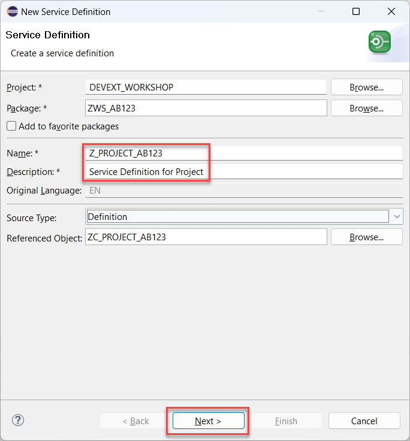
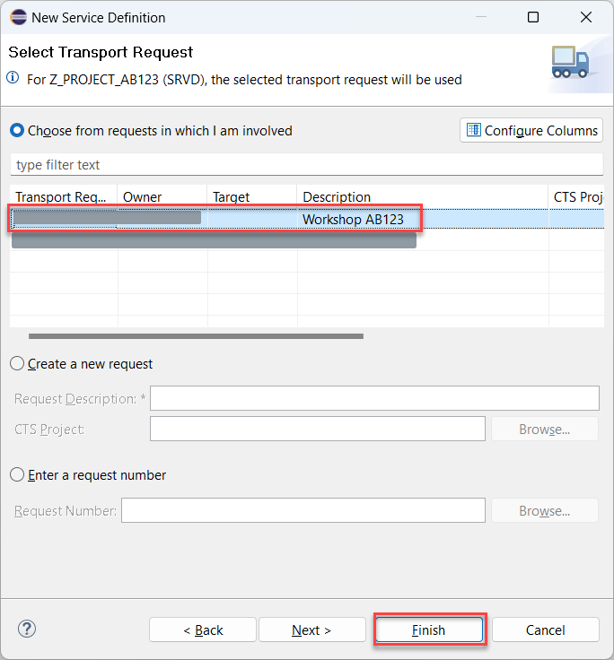
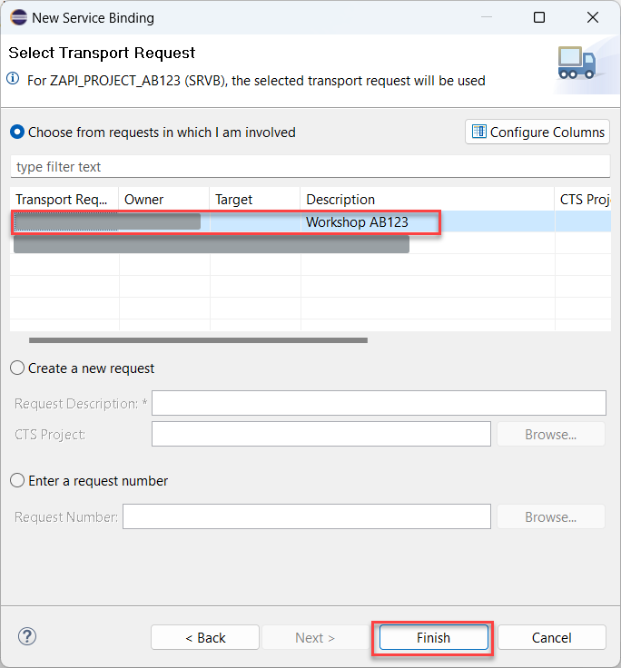
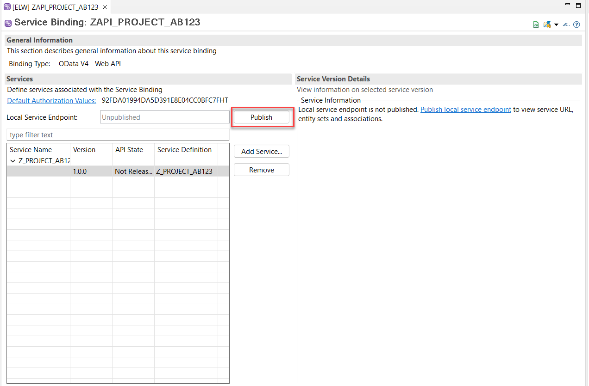

# Expose Service

## Introduction 

In this exercise, you will create objects needed to expose your data model as an OData service.

## Task Flow  

In this exercise, you will perform the following tasks:

1. Create service definition
2. Create service binding

## Content

### Task 1: Create service definition

1. Right click on the root projection view **ZC_PROJECT_{YOUR_ID}**.

2. Select **New Service Definition** in the popup menu.

   

3. Enter the following details and choose **Next**:
  - **Z_PROJECT_{YOUR_ID}** in the **Name** field
  - **Service Definition for Project** in the **Description** field

  

4. On the next screen select your transport and then choose **Finish** button.

   

5. Assign aliases to your Business Object projection entities and expose local associations as shown in the code below (considering **{YOUR_ID}** replacement):

  ~~~abap
  @EndUserText.label: 'Service Definition for Project'
  define service Z_PROJECT_{YOUR_ID} {
    expose ZC_PROJECT_{YOUR_ID}          as A_EnterpriseProject;
    expose ZC_PROJECT_EL_{YOUR_ID}       as A_EnterpriseProjectElement;
    expose I_EntProjProcessingStatus as A_EntProjProcessingStatus;
    expose I_ProjectProfileCode      as A_PorjectProfileCode;
  }
  ~~~

6. Select **Activate** button.

   

### Task 2: Create service binding

1. Right click on your service definition.

2. Select **New Service Binding** option in the popup menu.

   

3. Enter the following details and then choose **Next** button:
  - **ZAPI_PROJECT_{YOUR_ID}** in the **Name** field
  - **API V4 for Project** in the **Description** field
  - **OData V4 - Web API** in the **Binding Type** list box

   

4. On the next screen select your transport and choose **Finish** button.

   

5. Choose **Activate** button.

  

6. After the service binding was activated, choose **Publish** button.  

  

## Result

You have created a service definition and a service binding. Now your service is ready to be consumed. 

[Next tutorial: Create Communication Scenario](./scenario.md)

## Further reading / Reference Links

- [Service Definition](https://help.sap.com/docs/ABAP_PLATFORM_NEW/fc4c71aa50014fd1b43721701471913d/b09e4d53bfca4544a9f8910bcc2cd9d6.html)
- [Service Binding](https://help.sap.com/docs/ABAP_PLATFORM_NEW/fc4c71aa50014fd1b43721701471913d/b58a3c27df4e406f9335d4b346f6be04.html)
