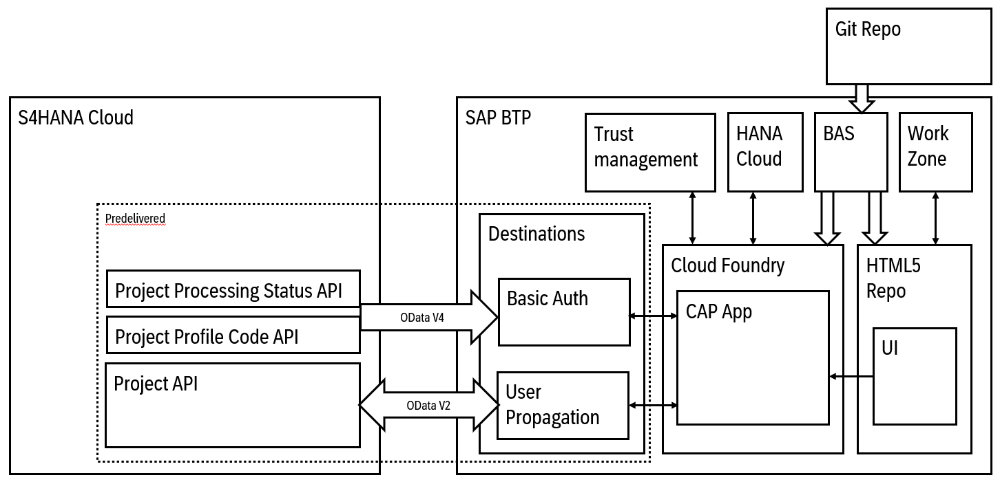
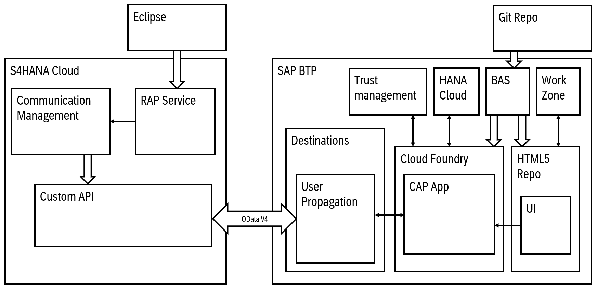

# Motivation

The deployed application works fine now. But there are still some issues like access with basic authentication, not optimal data reading (getting status for every project in a separate request), lack of OData V4 features for the Project API and so on. 

  

This can be fixed by creating an own service via SAP S/4HANA Cloud Developer Extensibility.

  

As always the creating of the own service has its pros and cons:

### Pros:
- Tailored API: cleaner and easier to understand/mock
- Better performance (no additional fields, data, views, etc.)
- Lower network overhead (no additional requests)
- Custom business logic is available
- Custom authentication control (OAuth)
- Custom authorization control
- OData V4 if necessary

### Cons:
- ABAP Developer skills are needed
- Lifecycle responsibility
- Standard business logic is not available

> The last 2 points could be eliminated by [extending the API](https://help.sap.com/docs/ABAP_PLATFORM_NEW/fc4c71aa50014fd1b43721701471913d/492d88ed89f640e5b18dd1c57f6817b1.html) without creating a new service instead. But this is not the focus of this workshop.

[Next tutorial: Connect to the System](./adt.md)

## Further reading / Reference Links

- [SAP ABAP RESTful Application Programming Model](https://help.sap.com/docs/ABAP_PLATFORM_NEW/fc4c71aa50014fd1b43721701471913d/289477a81eec4d4e84c0302fb6835035.html)
